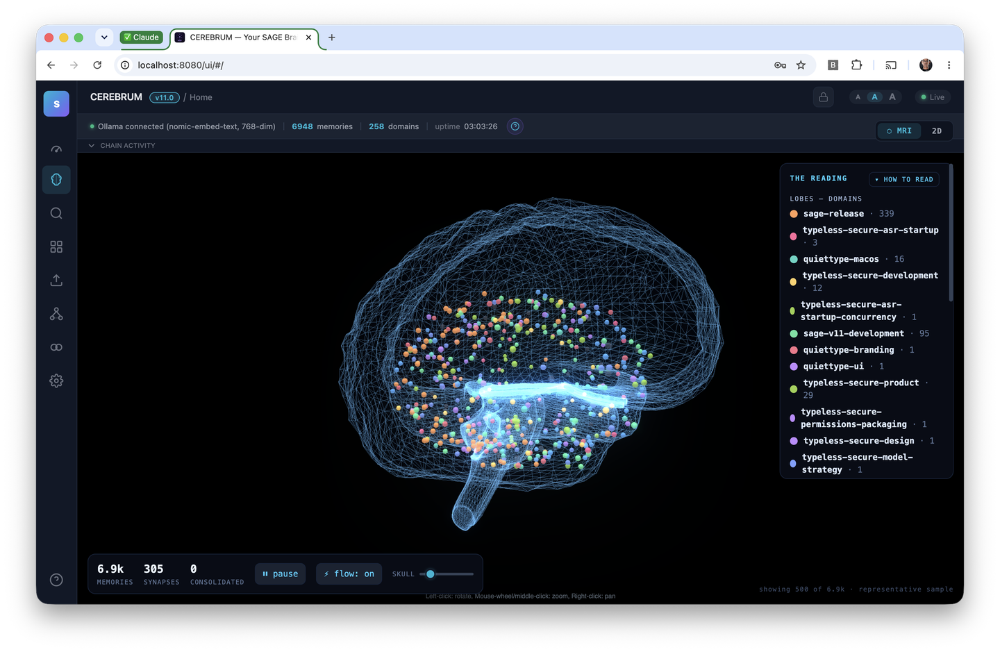
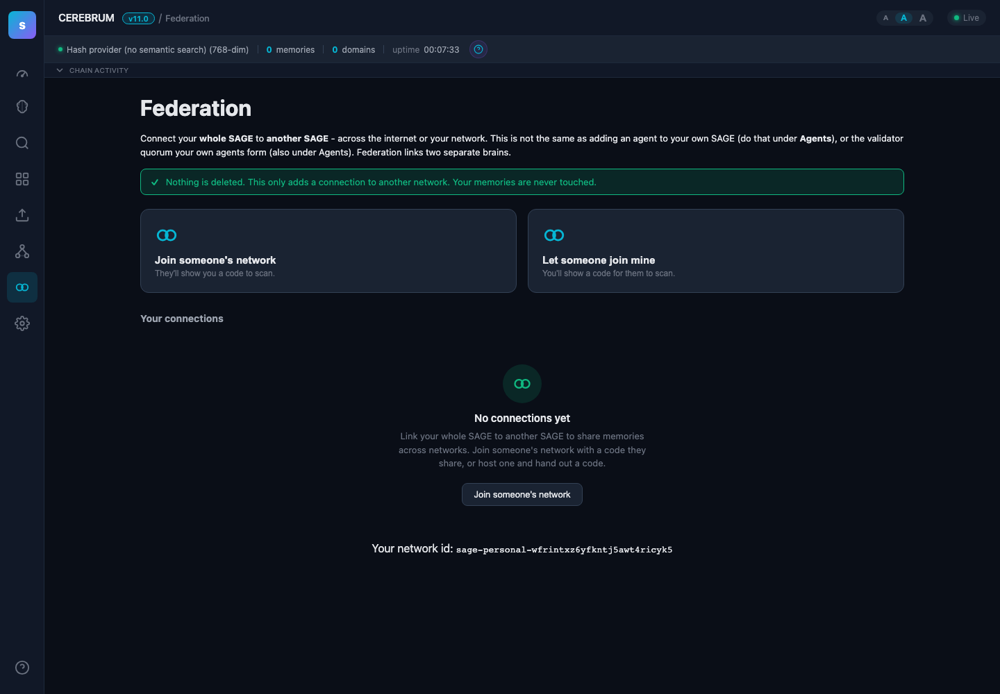
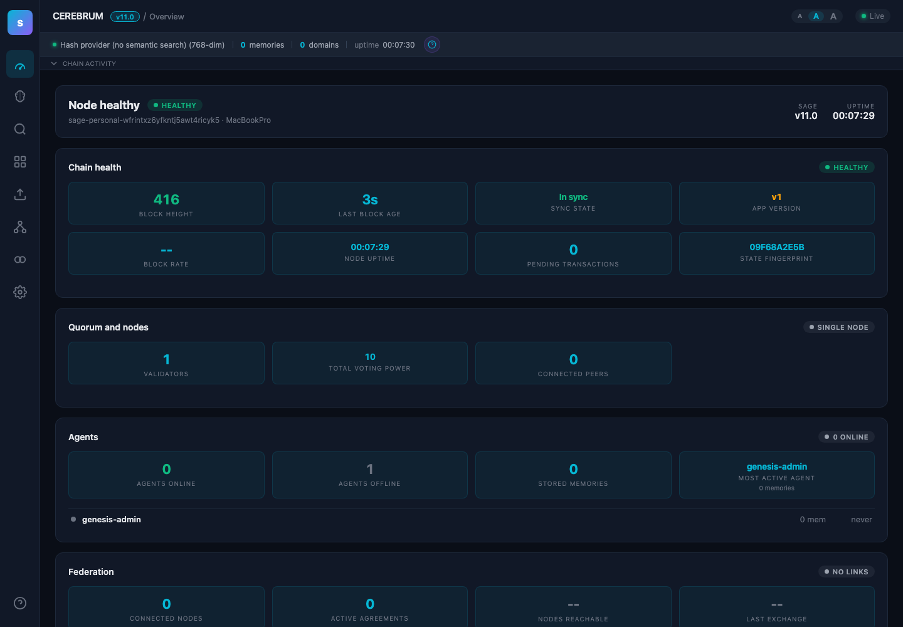
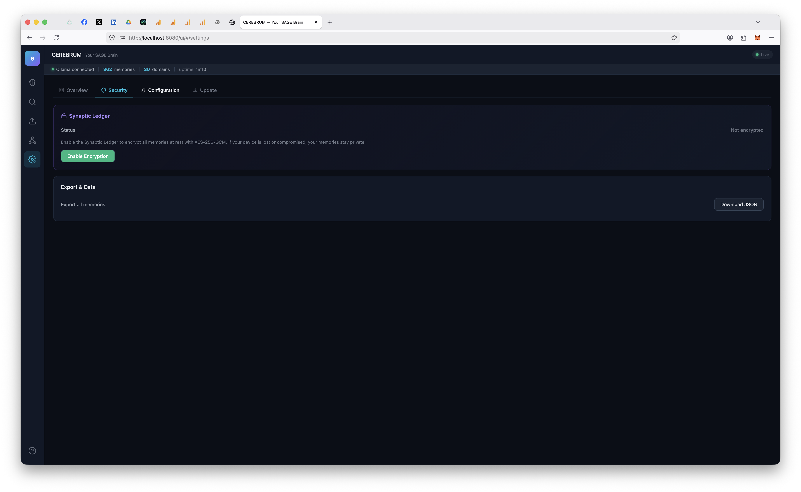
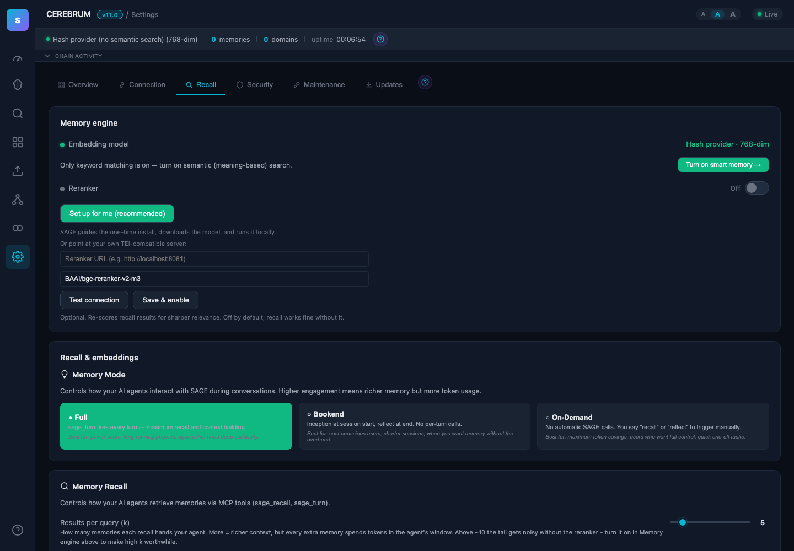

# (S)AGE — Sovereign Agent Governed Experience

**Persistent, consensus-validated memory infrastructure for AI agents.**

SAGE gives AI agents institutional memory that persists across conversations, goes through BFT consensus validation, carries confidence scores, and decays naturally over time. Not a flat file. Not a vector DB bolted onto a chat app. Infrastructure — built on the same consensus primitives as distributed ledgers.

The architecture is described in [Paper 1: Agent Memory Infrastructure](papers/Paper1%20-%20Agent%20Memory%20Infrastructure%20-%20Byzantine-Resilient%20Institutional%20Memory%20for%20Multi-Agent%20Systems.pdf).

> **Just want to install it?** [Download here](https://l33tdawg.github.io/sage/) — double-click, done. Works with any AI.

<a href="https://glama.ai/mcp/servers/l33tdawg/s-age">
  
</a>

---

## Architecture

```
Agent (Claude, ChatGPT, DeepSeek, Gemini, etc.)
  │ MCP / REST
  ▼
sage-gui
  ├── ABCI App (validation, confidence, decay, Ed25519 sigs)
  ├── App Validators (sentinel, dedup, quality, consistency — BFT 3/4 quorum)
  ├── Governance Engine (on-chain validator proposals + voting)
  ├── CometBFT consensus (single-validator or multi-agent network)
  ├── SQLite + optional AES-256-GCM encryption
  ├── CEREBRUM Dashboard (SPA, real-time SSE)
  └── Network Agent Manager (add/remove agents, key rotation, LAN pairing)
```

Personal mode runs a real CometBFT node with 4 in-process application validators — every memory write goes through pre-validation, signed vote transactions, and BFT quorum before committing. Same consensus pipeline as multi-node deployments. Add more agents from the dashboard when you're ready.

Full deployment guide (multi-agent networks, RBAC, federation, monitoring): **[Architecture docs](docs/ARCHITECTURE.md)**

---

## CEREBRUM Dashboard



`http://localhost:8080/ui/` — force-directed neural graph, domain filtering, semantic search, real-time updates via SSE.

### Network Management



Add agents, configure domain-level read/write permissions, manage clearance levels, rotate keys, download bundles — all from the dashboard.

### Settings

| Overview | Security | Configuration | Update |
|:---:|:---:|:---:|:---:|
|  |  |  |  |
| Chain health, peers, system status | Synaptic Ledger encryption, export | Boot instructions, cleanup, tooltips | One-click updates from dashboard |

---

## What's New in v6.7

- **HTTPS-capable HTTP MCP transport (6.7.0)** — SAGE is now addressable as an HTTP/HTTPS MCP server in addition to the existing stdio transport. Non-Claude-Code agents — ChatGPT, Cursor, Cline, and any custom HTTP MCP client — can now connect to SAGE without spawning `sage-gui mcp` as a subprocess. Three new endpoints under `/v1/mcp`:
  - `GET /v1/mcp/sse` — Server-Sent Events transport (older MCP spec, currently used by ChatGPT's connector). Persistent stream from server → client; pair with `POST /v1/mcp/messages?sessionId=…` for client → server JSON-RPC requests.
  - `POST /v1/mcp/streamable` — newer Streamable-HTTP single-endpoint transport for MCP clients that prefer one round-trip per call.
  - The same hand-rolled JSON-RPC dispatcher (`Server.DispatchJSONRPC`) handles BOTH the existing stdio path AND the new HTTP transports — no third-party MCP library, no duplicate tool routing. Tool registry in `internal/mcp/tools.go` is unchanged.

  TLS is on by default — `:8443` already serves the chi router, so the HTTP MCP endpoints inherit HTTPS automatically. Plain `:8080` is also live for local development. ChatGPT's MCP connector requires HTTPS, so the public-facing entry point is `https://<host>:8443/v1/mcp/sse`.

  **Bearer-token auth.** External MCP clients can't easily ed25519-sign every request, so we added a simple bearer-token path: `Authorization: Bearer <token>`. Tokens are 32 random bytes, base64url-encoded; we store the SHA-256 digest only, so a DB compromise can't leak working credentials. Token issuance/revocation is admin-managed via the existing ed25519-signed REST API at `POST /v1/mcp/tokens`, `GET /v1/mcp/tokens`, `DELETE /v1/mcp/tokens/{id}`. CLI parity: `sage-gui mcp-token create --agent <id> --name <label>`, `sage-gui mcp-token list`, `sage-gui mcp-token revoke <id>`.

  **CORS.** `/v1/mcp/*` reflects the request `Origin` (or wildcards if absent), allows the bearer-relevant headers (`Authorization`, `Content-Type`, `Mcp-Session-Id`), and answers preflight. MCP clients are first-class — same-origin paranoia doesn't apply to local development tools.

  **ChatGPT setup walkthrough.** Open ChatGPT → Settings → Connectors → Create New → MCP Server. Set:
  1. **Name:** SAGE (or whatever)
  2. **MCP Server URL:** `https://<your-host>:8443/v1/mcp/sse`
  3. **Authentication:** Custom (Bearer Token)
  4. **Token:** paste the value from `sage-gui mcp-token create --agent <your-agent-id> --name chatgpt`

  Self-signed cert note: SAGE auto-generates its own CA at `~/.sage/certs/` on first boot. ChatGPT's connector currently rejects self-signed certs, so for local-only setups you'll need to either (a) tunnel via cloudflared/ngrok and let the tunnel terminate TLS with a publicly-trusted cert, or (b) put SAGE behind a reverse proxy that uses a Let's Encrypt cert. ChatGPT cannot reach `localhost` either way — the tunnel/proxy is required for any cloud-hosted MCP client.

  Files: new `internal/mcp/http_transport.go` (SSE + Streamable transports + CORS middleware), new `api/rest/mcp_tokens_handler.go` (admin issue/list/revoke), new `api/rest/middleware/bearer.go` (bearer auth), new `internal/store/mcp_tokens.go` (SHA-256 digest store + `mcp_tokens` table). Tests: `internal/mcp/http_transport_test.go`, `api/rest/middleware/bearer_test.go`, `api/rest/mcp_tokens_handler_test.go`, `internal/store/mcp_tokens_test.go`. Stdio MCP path is untouched — Claude Code spawning `sage-gui mcp` still works exactly as before.

## What's New in v6.6

- **Tags on propose + tag-filtered semantic recall (6.6.0)** — `POST /v1/memory/submit` now accepts `tags`, and `/v1/memory/query` and `/search` accept a `tags` filter (any-match / OR semantics). MCP `toolRemember` drops the old 2-step tag dance — single atomic submit. Python SDK: `propose(tags=...)` and `query(tags=...)`.
- **Offchain SQLITE_BUSY silent-drop fix (6.6.1)** — Under sustained SQLite lock contention, the offchain `Commit()` flush could exhaust its retry budget, log CRITICAL, and silently clear pending writes while BadgerDB had already advanced — CometBFT then skipped replay on restart and the writes were lost invisibly. Now: flush runs *before* BadgerDB state is saved, retry budget raised to 30 attempts, panic on exhaustion so CometBFT replays the block. First surfaced by Level Up: 521 accepted submits with zero new visible memories across 96 hours on 6.5.5.
- **Silent-filter observability (6.6.2)** — `/v1/memory/list`, `/query`, `/search` now set an `X-SAGE-Filter-Applied` header and a `filtered` JSON envelope whenever either silent-hide filter ran. `/list` includes `total_before_filter` + `visible` counts; `/query`/`/search` include `hidden_count`. Empty-domain vs RBAC-filtered is finally distinguishable.
- **Org-clearance-as-seeAll (6.6.2)** — TopSecret (clearance=4) org members bypass the `submitting_agents` RBAC filter automatically. Per-domain access control and per-record classification gates still apply. Closes the `visible_agents="*"` boilerplate for single-org deployments.
- **Admin bootstrap playbook (6.6.2)** — New `docs/ADMIN_BOOTSTRAP.md` documents three deployment patterns (single-org, multi-org federated, homogeneous-trust legacy) with setup commands and the chain-reset visibility gotcha.
- **ABCI healthcheck + chain-bootstrap-window doc (6.6.3)** — `deploy/Dockerfile.abci` ships a HEALTHCHECK with `start_period=5m` to cover the ~3min CometBFT cold-start window on fresh data dirs, so Docker doesn't false-flag containers as unhealthy during normal bootstrap. Doc adds the 503-vs-connection-refused diagnostic and orchestrator guidance for Kubernetes `startupProbe`.
- **Root-cause SQLite pragma fix, tx serialization, post-commit context (6.6.4)** — Three cascading bugs surfaced by concurrent propose-with-tags workloads: (1) the `_journal_mode=WAL` DSN form is silently dropped by `modernc.org/sqlite` — the DB has been running in rollback-journal mode with `busy_timeout=0` since the driver switch, which is the root cause behind the 6.6.1 symptom (now fixed at source with `_pragma=journal_mode(WAL)` and explicit follow-up PRAGMAs as belt-and-braces); (2) `SetTags` + 5 other store methods opened transactions with raw `s.db.BeginTx`, bypassing the writeMu that writeExecContext/RunInTx use to serialize writes — fixed via a new `beginTxLocked` helper; (3) post-commit `SetTags` and `UpdateAgentLastSeen` ran on `r.Context()`, so a client disconnect (SIGKILL, timeout) between `broadcastTxCommit` returning and the tag write left untagged orphan rows that broke tag-based idempotency — now run under a 10s background context. Also: `POST /v1/agent/register` first-time registration now surfaces `on_chain_height` (previously only returned on the idempotent `already_registered` path, which SDK callers read as a version-drift signal). First surfaced by RAPTOR's `libexec/raptor-sage-setup` — concurrent `asyncio.gather(Semaphore(8))` proposes produced 396 SQLITE_BUSY + 197 tag-write failures on 6.6.3, zero after the fix.
- **`sage_recall` no longer surfaces a cryptic FTS5 error on vault-encrypted nodes (6.6.10)** — On a node with the synaptic-ledger vault unlocked, memory content is AES-256-GCM encrypted at rest, so SQLite FTS5 cannot text-index it. `internal/store/sqlite.go:SearchByText` correctly bails with a hard error in that case — but `internal/mcp/tools.go:toolRecall` was routing to that very FTS5 path (`POST /v1/memory/search`) whenever `isSemanticMode(ctx)` returned false. `isSemanticMode` decides from `/v1/embed/info`'s `semantic` field, which `api/rest/embed_handler.go:handleEmbedInfo` derived purely from `embedder.Semantic()` — vault-state was nowhere in the decision. Result: any vault-active node without an Ollama embedder configured silently degraded every `sage_recall` call into the literal error string `"text search unavailable: content is encrypted — use semantic search with Ollama"` bubbled verbatim through MCP to the agent, which has no `sage_recall` knob to "switch to semantic" — they just called the tool and got an error they couldn't act on. Multiple agents on the SAGE network hit this for weeks before Dhillon caught it on a freshly-registered claude-code agent. Fix is two-layered: (1) `handleEmbedInfo` now type-asserts the store to `vaultStatusReporter` (new `SQLiteStore.VaultActive()` method) and forces `semantic=true` whenever the vault is active — even if no embedder is configured, so the embed call fails with a clearer downstream error rather than the cryptic FTS5 path; (2) belt-and-braces in `toolRecall`: if the FTS5 path's `doSignedJSON` returns an error containing the marker `"text search unavailable: content is vault-encrypted"`, the handler logs a warning, warms the `semanticMode` cache to `true`, and retries via the new shared `recallSemantic` helper — so older nodes that haven't been upgraded still recover gracefully. The marker constant lives at `internal/mcp/tools.go:vaultEncryptedSearchMarker` paired with `internal/store/sqlite.go:ErrTextSearchVaultEncryptedMsg` (the canonical wording — `"text search unavailable: content is vault-encrypted; this node is in semantic-only mode"` — replaces the old "use Ollama" message that was misleading because there's nothing the caller can do at the MCP layer). Tests: `internal/store/sqlite_test.go:TestSearchByText_VaultActiveErrors` (vault-on returns the encryption error) and `internal/mcp/tools_test.go:TestSageRecall_VaultActiveForcesSemantic` + `TestSageRecall_RetriesSemanticOnVaultEncryptedFTSError` (mock `/v1/embed/info` to honestly report semantic, mock to lie and return the FTS error and verify retry) plus `api/rest/embed_handler_test.go:TestHandleEmbedInfo_VaultActiveForcesSemantic`. Boundary: `internal/store/postgres.go` is untouched (its "text search not available" error is documented as expected behavior), and the FTS5-vs-encryption architectural constraint is unchanged — we fixed routing/UX, not the indexing reality.
- **Org name lookup endpoint + SDK routing (6.6.9)** — `client.get_org("levelup")` previously 404'd because the Python SDK passed the human-readable name straight into `GET /v1/org/{org_id}`, which the REST handler treated as an opaque orgID. There was no name→orgID resolver anywhere in the stack, and `processOrgRegister` doesn't enforce name uniqueness — orgID is `sha256(adminID + ":" + name + ":" + height)` so two admins (or the same admin at different heights) can both register an org named "levelup" and land in distinct orgID slots. Fix: a one-to-many `org_name:<name>:<orgID>` reverse index in BadgerDB, maintained from `RegisterOrg` and backfilled idempotently from existing `org:*` forward entries on every `NewBadgerStore` open (so in-place upgrades work without a chain reset). New `GET /v1/org/by-name/{name}` returns `{"orgs": [...]}` — empty result is HTTP 200 (a valid answer), not 404. Python SDK `get_org(identifier)` now sniffs the input: 32-char lowercase hex routes to `/v1/org/{id}` unchanged; anything else hits the by-name endpoint and returns the single match, raising `SageAPIError(404)` for zero matches and `ValueError` for >1 matches so callers can disambiguate via `list_orgs_by_name`. **Known quirk surfaced by the new endpoint:** the same human-readable name can map to multiple orgIDs — this was already true in v6.6.8 but the SDK assumption hid it; we left `processOrgRegister` alone (name-uniqueness enforcement is a behavior change worth a separate discussion). Reported by the Level Up team on v6.6.8 validation. Tests: `internal/store/badger_multiorg_test.go` (empty, single, multi-admin, legacy backfill, store-open auto-backfill) + `api/rest/org_byname_test.go`.
- **`PUT /v1/agent/{id}/permission` no longer silently no-ops for non-admin callers (6.6.9)** — A non-prod-admin caller setting `visible_agents="*"` (or any other field) on `PUT /v1/agent/{id}/permission` previously got HTTP 200 with a real `tx_hash` while the SQL row stayed untouched. Two cascading defects: (1) the REST handler used `broadcast_tx_sync`, which only inspects CheckTx (signature/nonce) — the FinalizeBlock rejection (`code=67 "not an admin"`) was never propagated to the client, so the API confirmed success for a write the chain had refused; (2) the ABCI handler `processAgentSetPermission` hard-gated on the on-chain global `Role=="admin"`, meaning ONLY the original deployment-admin identity could ever land a permission write — so the most common deployment pattern (an agent declaring its own RBAC surface, or an org admin configuring a member) silently returned 200 + empty SQL. Reported by the Level Up team while validating v6.6.8. Fix: REST does a fail-fast pre-flight RBAC check using BadgerDB (`callerCanSetPermission`) and switches to `broadcast_tx_commit` so any consensus-side rejection still surfaces (`broadcastErrorStatus` maps "access denied" to HTTP 403); ABCI auth model widens to *self-set* OR *global admin* OR *org admin of any org the target also belongs to* (using the `agent_orgs` index from v6.6.8 + `GetMemberClearance` for role lookup). The auth model lives in code comments at both `api/rest/agent_handler.go:handleAgentSetPermission` and `internal/abci/app.go:processAgentSetPermission` so the two layers can't drift. Regression tests in `api/rest/permission_handler_test.go` cover self-set, org-admin, global-admin, unauthorized-403 (no broadcast, no tx_hash), and FinalizeBlock-rejection-surfaces-as-403; `internal/abci/app_test.go` adds matching ABCI-level coverage.
- **Multi-org membership no longer silently strips access (6.6.8)** — `BadgerStore.AddOrgMember` previously maintained an `agent_org:<agentID>` *single-slot* reverse lookup that every new add overwrote. The forward `org_member:` entries (clearance, role, height) for prior orgs survived, but `HasAccessMultiOrg` and `agentHasTopSecretClearance` only consulted the single slot — so the moment a pipeline agent was added to a second org, queries scoped against the first org's domains returned HTTP 200 with zero memories despite the agent still being a `clearance=4` member there. Reported by the Level Up agent (4 pipeline agents added to a new tenant org disappeared from prod-org recall). Fix: a one-to-many `agent_orgs:<agentID>:<orgID>` reverse index, additive on every add and surgically removed on `RemoveOrgMember` (legacy single slot rebound deterministically to the lexically smallest remaining org so federation governance auto-pickers don't break). `HasAccessMultiOrg` now iterates every org the agent belongs to and every org the domain owner belongs to, granting same-org clearance against any matching pair and falling back to a federation check across the cartesian product. `agentHasTopSecretClearance` returns true if TS in *any* org. Federation `propose`/`approve`/`revoke` ABCI handlers verify membership of the *specified* org (`IsAgentInOrg`) instead of comparing against the legacy primary slot, so multi-org admins can act on either side of a federation. `NewBadgerStore` runs an idempotent backfill from the authoritative `org_member:` forward index, so in-place upgrades from pre-v6.6.8 schemas work without a chain reset. Regression tests in `internal/store/badger_multiorg_test.go`.
- **Encrypted CA private key in quorum manifest (6.6.6/6.6.7)** — `sage-gui quorum-init` previously embedded the quorum CA private key as plaintext PEM inside `quorum-manifest.json`. Anyone who got the file (misdelivered email, Slack drop, shared backup) had the CA forever and could mint valid TLS certs for the quorum. Now: the CA key is wrapped with an Argon2id + AES-256-GCM envelope (`internal/tlsca/manifest_crypt.go`) keyed by an operator passphrase set via `SAGE_QUORUM_PASSPHRASE` env var or interactive prompt. Share the passphrase OUT-OF-BAND (different channel from the manifest file). `quorum-join` prompts for it on import; tampered envelopes (flipped salt/nonce/ciphertext bytes) fail closed via authenticated encryption. Pre-encryption manifests with plaintext `ca_key` are rejected outright with a regen prompt. v6.6.7 = v6.6.6 + golangci-lint shadow fixes that blocked the v6.6.6 release workflow.

<details>
<summary>Full v6.6.x changelog</summary>

- v6.6.10: `sage_recall` UX fix on vault-encrypted nodes — `/v1/embed/info` forces `semantic=true` when the store reports `VaultActive()`; MCP `toolRecall` adds a belt-and-braces retry that re-runs the semantic path when the FTS5 path returns the vault-encrypted marker; cleaner SQLite error wording.
- v6.6.9: Org name lookup (`GET /v1/org/by-name/{name}` + SDK hex-vs-name routing) AND `PUT /v1/agent/{id}/permission` silent-failure fix (REST pre-flight RBAC + `broadcast_tx_commit`; ABCI auth widened to self-set / global-admin / org-admin)
- v6.6.8: Multi-org membership fix — `agent_orgs` one-to-many reverse index, `HasAccessMultiOrg` iterates, federation handlers gated by `IsAgentInOrg`
- v6.6.7: Encrypted CA key in quorum manifest (lint-fix re-cut of v6.6.6)
- v6.6.6: Encrypted CA key in quorum manifest (release blocked by lint; superseded by v6.6.7)
- v6.6.5: Python SDK version alignment (PyPI publish repair for v6.6.4)
- v6.6.4: SQLite pragma root-cause fix + writeMu-guarded BeginTx + post-commit background context + first-register on_chain_height
- v6.6.3: ABCI HEALTHCHECK + chain-bootstrap-window doc
- v6.6.2: Silent-filter observability + org-clearance-as-seeAll + admin bootstrap docs
- v6.6.1: Offchain SQLITE_BUSY silent-drop fix (correctness; flush-before-badger reorder)
- v6.6.0: Tags on propose/query + `/v1/agent/register` response field rename to `on_chain_height`

</details>

### v6.5 Highlights

- **Encrypted Node-to-Node Communication (6.5.0)** — REST API TLS support for quorum mode. Per-quorum ECDSA P-256 certificate authority, auto-generated during `quorum-init`/`quorum-join`. Dual-listener pattern: TLS on `:8443` for network traffic, plain HTTP on `localhost:8080` for dashboard/MCP.
- **CometBFT P2P Already Encrypted (6.5.0)** — Verified that CometBFT v0.38.15 encrypts all validator-to-validator gossip via SecretConnection (X25519 DH + ChaCha20-Poly1305). No plaintext memories on the wire.
- **TLS Certificate Infrastructure (6.5.0)** — New `internal/tlsca/` package: CA generation, node cert generation, PEM I/O, TLS config builders. `sage-gui cert-status` CLI for expiry monitoring. Python SDK v6.1.0 adds `ca_cert` parameter.
- **Stuck-proposed deprecation + vote dedup (6.5.1)** — When all validators voted but quorum (2/3) wasn't reached (e.g. 2-2 tie), memories stayed in `proposed` forever and the validator ticker re-voted every 2 seconds (~1.4M redundant txs over 8 days for one stuck memory). Now: deprecate the memory when votes are in but quorum is missed, and track per-session voted memories to prevent re-vote.
- **`/v1/memory/{id}/forget` + SDK `forget()` (6.5.4)** — Closes a semantic gap where "forget" was the user-facing verb across MCP/dashboard/docs but only `/challenge` existed. New endpoint is a thin alias for challenge with an optional reason (defaults to "deprecated by user" — `challenge` requires a non-empty reason, `forget` is forgiving for dedup callers).
- **RBAC ownership theft fix + real broadcast errors (6.5.5)** — Two bugs masqueraded as generic "Failed to broadcast" errors when CometBFT was fine and FinalizeBlock was returning "access denied". Fix: reserve `general` and `self` as shared catch-all domains (never auto-registered), make `RegisterDomain` check-and-set instead of silent overwrite, add `TransferDomain` for explicit admin transfers, and surface the real broadcast error from REST handlers (403 on access-denied instead of generic 500).

<details>
<summary>Full v6.5.x changelog</summary>

- v6.5.5: RBAC ownership theft fix; real broadcast error surfacing
- v6.5.4: `/v1/memory/{id}/forget` endpoint + SDK `forget()` method
- v6.5.3: RBAC regression test backfill for Level Up bug reports
- v6.5.2: CI workaround for GitHub Pages duplicate-artifact errors (reverted in 6.5.3)
- v6.5.1: Deprecate stuck proposed memories when quorum cannot be reached; per-session vote dedup
- v6.5.0: TLS everywhere — encrypted REST API for quorum mode, per-quorum CA

</details>

### v6.0 Highlights

- **Dynamic Validator Governance** — Validators can now be added, removed, and have their power updated **without stopping the chain**. Admin agents submit governance proposals, validators vote on-chain with 2/3 BFT quorum, and CometBFT applies validator set changes at consensus level. Zero downtime.
- **On-Chain Governance Engine** — New `internal/governance/` package with deterministic integer-only quorum math, proposal lifecycle (voting → executed/rejected/expired/cancelled), proposer cooldown, min voting period, and power constraints. All state in BadgerDB, included in AppHash.
- **Governance Dashboard** — New Governance section in the CEREBRUM Network page. Active proposal cards with vote tally, quorum progress bar, expiry countdown, and one-click voting. Proposal history with status badges. "New Proposal" wizard for admins.
- **Security Constraints** — 1/3 max power for new validators (prevents single-add takeover), min 2 validators after removal, 50-block proposer cooldown (prevents grief), 500-block max proposal TTL (prevents governance lockup), admin-only proposals, validator-only voting.

### v5.x Highlights

- **FTS5 Full-Text Search** — Keyword-based recall fallback when embeddings aren’t semantic.
- **Docker Compose** — `docker-compose.sage-gui.yml` with Ollama sidecar for semantic embeddings.
- **Consensus-First Writes** — Memory submissions go through full BFT consensus before appearing in queries.
- **Byzantine Fault Tests in CI** — 4-validator Docker cluster with fault injection.
- **Nonce Replay Protection** — Random nonce in request signing prevents sub-second replay collisions.
- **Docker Env Vars** — `OLLAMA_URL` and `OLLAMA_MODEL` properly configure embeddings in Docker.

<details>
<summary>Full v5.x changelog</summary>

- v5.4.5: Docker env var support for OLLAMA_URL/OLLAMA_MODEL
- v5.4.4: Empty blocks fix for single-node idle timeout prevention
- v5.4.3: Null array fix (return `[]` not `null` for empty results)
- v5.4.2: Nonce verification threaded through full tx pipeline
- v5.4.1: Random nonce for replay protection
- v5.4.0: FTS5 search, Docker Compose with Ollama
- v5.3.x: Consensus-first writes, Byzantine CI tests, Docker hardening, write serialization
- v5.2.x: Immutable RegisteredName, self-updater fix, memory type guidance
- v5.1.0: Agent rename fix, self-healing name reconciliation
- v5.0.x: Agent pipeline, Python SDK, vault recovery, memory modes, MCP identity fix, Docker fix

</details>

### v4.x Highlights

- **4 Application Validators** — Sentinel, Dedup, Quality, Consistency with 3/4 BFT quorum.
- **RBAC** — Agent isolation by default, domain-level permissions, clearance levels, multi-org federation.
- **Synaptic Ledger** — AES-256-GCM encryption with Argon2id key derivation, vault lock/unlock.

### v3.x Highlights

- **Multi-Agent Networks** — Add agents from dashboard, LAN pairing, key rotation, redeployment orchestrator.
- **On-Chain Agent Identity** — Registration, permissions, and metadata through CometBFT consensus.
- **CEREBRUM Dashboard** — Brain graph, focus mode, timeline, search, draggable panels.

---

## Research

| Paper | Key Result |
|-------|------------|
| [Agent Memory Infrastructure](papers/Paper1%20-%20Agent%20Memory%20Infrastructure%20-%20Byzantine-Resilient%20Institutional%20Memory%20for%20Multi-Agent%20Systems.pdf) | BFT consensus architecture for agent memory |
| [Consensus-Validated Memory](papers/Paper2%20-%20Consensus-Validated%20Memory%20Improves%20Agent%20Performance%20on%20Complex%20Tasks.pdf) | 50-vs-50 study: memory agents outperform memoryless |
| [Institutional Memory](papers/Paper3%20-%20Institutional%20Memory%20as%20Organizational%20Knowledge%20-%20AI%20Agents%20That%20Learn%20Their%20Jobs%20from%20Experience%20Not%20Instructions.pdf) | Agents learn from experience, not instructions |
| [Longitudinal Learning](papers/Paper4%20-%20Longitudinal%20Learning%20in%20Governed%20Multi-Agent%20Systems%20-%20How%20Institutional%20Memory%20Improves%20Agent%20Performance%20Over%20Time.pdf) | Cumulative learning: rho=0.716 with memory vs 0.040 without |

---

## Quick Start

```bash
git clone https://github.com/l33tdawg/sage.git && cd sage
go build -o sage-gui ./cmd/sage-gui/
./sage-gui setup    # Pick your AI, get MCP config
./sage-gui serve    # SAGE + Dashboard on :8080
```

Or grab a binary: [macOS DMG](https://github.com/l33tdawg/sage/releases/latest) (signed & notarized) | [Windows EXE](https://github.com/l33tdawg/sage/releases/latest) | [Linux tar.gz](https://github.com/l33tdawg/sage/releases/latest)

### Docker

```bash
docker pull ghcr.io/l33tdawg/sage:latest
docker run -p 8080:8080 -v ~/.sage:/root/.sage ghcr.io/l33tdawg/sage:latest
```

Pin a specific version with `ghcr.io/l33tdawg/sage:6.0.0`.

### Upgrading from an older version?

If you installed SAGE before v5.0 and your AI isn't doing turn-by-turn memory updates, re-run the installer in your project directory:

```bash
cd /path/to/your/project
sage-gui mcp install
```

This installs Claude Code hooks that enforce the memory lifecycle (boot, turn, reflect) — even if your `.mcp.json` is already configured. Restart your Claude Code session after running this.

---

## Documentation

| Doc | What's in it |
|-----|-------------|
| [Architecture & Deployment](docs/ARCHITECTURE.md) | Multi-agent networks, BFT, RBAC, federation, API reference |
| [Getting Started](docs/GETTING_STARTED.md) | Setup walkthrough, embedding providers, multi-agent network guide |
| [Security FAQ](SECURITY_FAQ.md) | Threat model, encryption, auth, signature scheme |
| [Connect Your AI](https://l33tdawg.github.io/sage/connect.html) | Interactive setup wizard for any provider |

---

## Stack

Go / CometBFT v0.38 / chi / SQLite / Ed25519 + AES-256-GCM + Argon2id / MCP

---

## License

Code: [Apache 2.0](LICENSE) | Papers: [CC BY 4.0](https://creativecommons.org/licenses/by/4.0/)

## Author

Dhillon Andrew Kannabhiran ([@l33tdawg](https://github.com/l33tdawg))

---

<p align="center"><em>A tribute to <a href="http://phenoelit.darklab.org/fx.html">Felix 'FX' Lindner</a> — who showed us <b>how much further curiosity can go.</b></em></p>
